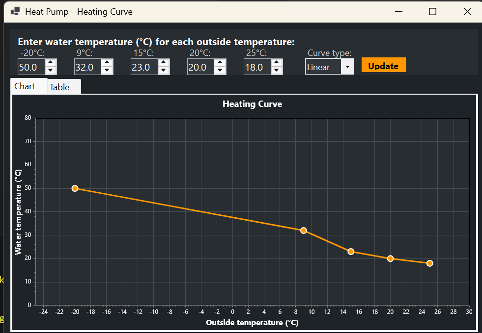

# Heat Pump Heating Curve Calculator

A Windows Forms application for visualizing and calculating heat pump heating curves. This tool helps you determine the optimal water temperature for your heat pump system based on outside temperature conditions.



## Features

- 🌡️ **Interactive Input**: Enter water temperatures for 5 key outside temperature points (-20°C, 9°C, 15°C, 20°C, 25°C)
- 📊 **Visual Chart**: Real-time visualization of your heating curve with data point markers
- 📋 **Detailed Table**: View interpolated water temperatures for every 1°C interval from -20°C to 25°C
- 🔄 **Dual Interpolation Modes**:
  - **Linear**: Simple straight lines between data points
  - **Smooth**: Cubic spline interpolation for gradual transitions
- 💾 **Persistent Settings**: Your configuration is automatically saved and restored
- 🎨 **Modern Dark Theme**: Easy on the eyes with a professional appearance

## What is a Heating Curve?

A heating curve defines the relationship between outside temperature and the desired water temperature in your heating system. The heat pump uses this curve to automatically adjust the water temperature to maintain comfortable indoor conditions while maximizing energy efficiency.

## Installation

### Prerequisites
- Windows 10 or later
- [.NET 8.0 Runtime](https://dotnet.microsoft.com/download/dotnet/8.0) (Desktop Runtime)

### Running from Source
```bash
git clone https://github.com/yourusername/HeatPumpCurve.git
cd HeatPumpCurve/HeatPumpCurve
dotnet run
```

### Building
```bash
dotnet build -c Release
```

The executable will be in `bin/Release/net8.0-windows/`

## Usage

1. **Enter Water Temperatures**: Input the desired water temperature for each outside temperature point
2. **Choose Curve Type**: Select Linear for traditional heating curves or Smooth for gradual transitions
3. **Click Update**: Apply changes to see the updated chart and table
4. **Switch Views**: Toggle between Chart and Table tabs to see different representations
5. **Your Settings**: All values are automatically saved when you close the application

### Example Configuration
- At -20°C outside → 53°C water temperature (coldest weather, maximum heating)
- At 25°C outside → 18°C water temperature (warm weather, minimal heating)

## Technology Stack

- **Framework**: .NET 8.0 Windows Forms
- **Charting**: [ScottPlot 5.0](https://scottplot.net/) - High-performance plotting library
- **Interpolation**: Custom cubic spline implementation
- **Data Persistence**: JSON-based settings storage

## Project Structure

```
HeatPumpCurve/
├── MainForm.cs              # Main UI and application logic
├── HeatingCurveSettings.cs  # Settings persistence
├── SplineInterpolator.cs    # Cubic spline interpolation algorithm
├── Program.cs               # Application entry point
└── HeatPumpCurve.csproj     # Project configuration
```

## Settings Storage

Settings are stored in JSON format at:
```
%AppData%\HeatPumpCurve\settings.json
```

This includes:
- Water temperatures for all 5 data points
- Selected interpolation mode (Linear/Smooth)

## Contributing

Contributions are welcome! Please feel free to submit a Pull Request. For major changes, please open an issue first to discuss what you would like to change.

### Development Guidelines
- Follow existing code style and conventions
- Add comments for complex logic
- Test changes thoroughly before submitting

## License

This project is licensed under the MIT License - see the [LICENSE](LICENSE) file for details.

## Acknowledgments

- [ScottPlot](https://scottplot.net/) for the excellent charting library
- Heat pump community for inspiration and use cases

## Support

If you find this tool helpful, please ⭐ star the repository!

For issues or questions, please [open an issue](https://github.com/yourusername/HeatPumpCurve/issues).

## Version History

### v1.0.0 (2026-01-09)
- Initial release
- Linear and smooth interpolation modes
- Persistent settings
- Chart and table views
- Dark theme UI
